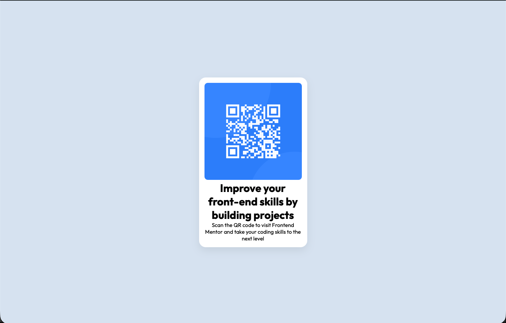

# Frontend Mentor - QR code component solution

This is a solution to the [QR code component challenge on Frontend Mentor](https://www.frontendmentor.io/challenges/qr-code-component-iux_sIO_H). The goal of this challenge was to recreate a responsive QR Code card using semantic HTML and CSS while following the provided design as closely as possible. Frontend Mentor challenges help you improve your coding skills by building realistic projects. 

## Overview

### Screenshot

### Links

- Solution URL: https://github.com/Dantas-Lab/qr-code-component
- Live Site URL: https://dantas-lab.github.io/qr-code-component/

## My process

### Built with

- Semantic HTML5 markup
- CSS3
- Flexbox
- Mobile-first workflow
- Git & GitHub
- GitHub Pages

### What I learned

This project helped me reinforce several fundamental front-end concepts:

 - Structuring a webpage using semantic HTM
 - Applying CSS styling based on a design reference
 - Centering elements using Flexbox
 - Working with spacing, typography and responsive layouts
 - Creating and publishing a project using Git, GitHub and GitHub pages

### Continued development

As I continue my Front-End learning journey, I want to focus on:
- Improving responsive design techniques
- Building more complex layouts with Flexbox and CSS Grid
- Evolve in JavaScript
- Developing reusable and scalable front-end components

### AI Collaboration

For this project I used ChatGPT as assistant to help me:
- Remember HTML and CSS concepts
- Troubleshoot layout and styling issues
- Publish the project using GitHub Pages

## Author

- GitHub - https://github.com/Dantas-Lab
- Frontend Mentor - [@Dantas-Lab](https://www.frontendmentor.io/profile/Dantas-Lab)

## Acknowledgments

Thanks to the Frontend Mentor community for providing beginner-friendly challenges that help developers practice real-world front-end skills.

